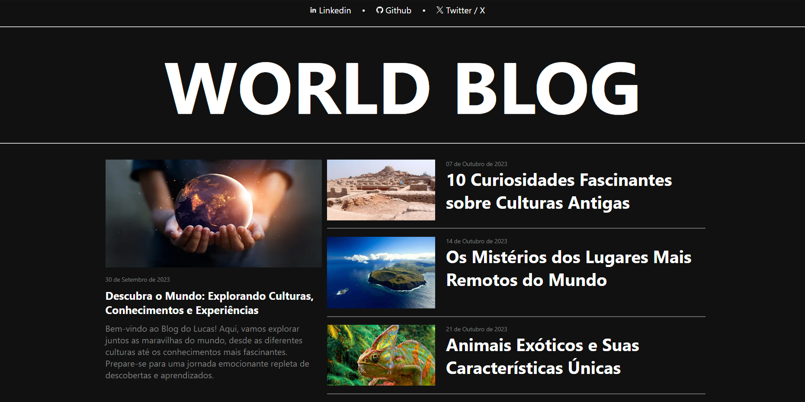
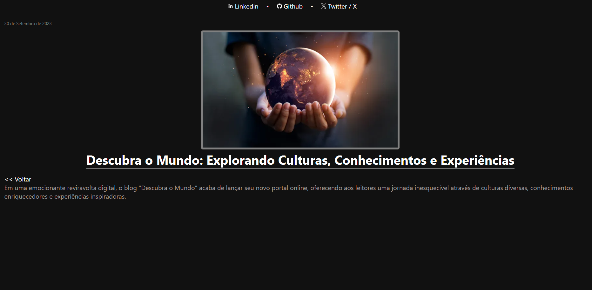
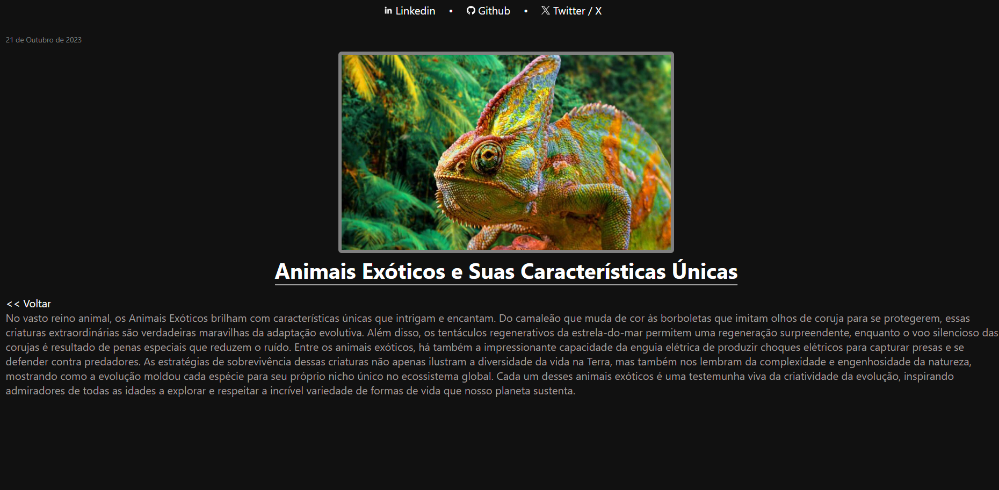
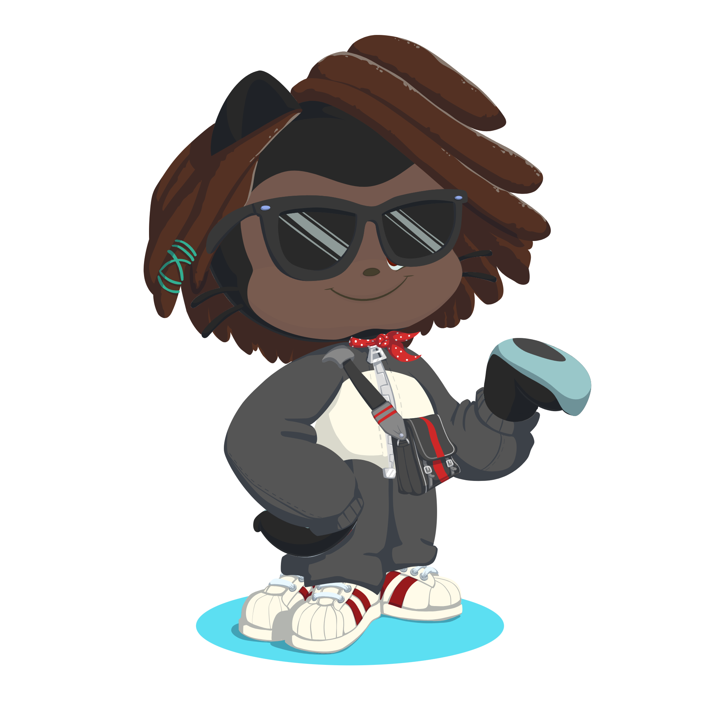

# Projeto - Blog

Projeto destinado a criação de um modelo de blog com o framework Angular, baseando-se em um layout adquirido no Dribbble

## Desenvolvimento

Para desenvolvimento do blog foi utilizado a versão 14.1.2 do Angular.

O Blog ainda está bem simples, possui apenas a homepage e a pagina de noticia que é dinâmica de acordo com a notícia passada

### Homepage do blog

### Pagina de noticia

## Projeto realizado por Lucas Cipriano

